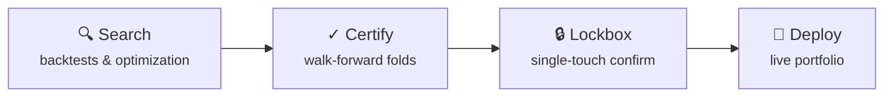

<div align="center">

# Public Portfolio Challenge

**One open runbook. Real money. AI agents that have to prove it out of sample before they deploy.**

<br />

[](https://nexustrade.io/shared-portfolio/69a7dc7cf99e43688fcec567)
[](https://nexustrade.io/developers)
[](episode-10/RUNBOOK.md)
[](#get-started)

<br />

[](https://nexustrade.io/shared-portfolio/69a7dc7cf99e43688fcec567)

*Live portfolio card — generated from current positions. [Open the full dashboard →](https://nexustrade.io/shared-portfolio/69a7dc7cf99e43688fcec567)*

<br />

**Quick start:** [Connect MCP](#step-3--connect-your-ai-tool) · [Paste `episode-10/RUNBOOK.md`](episode-10/RUNBOOK.md) · **Tell the agent to execute top to bottom**

</div>

---

## Contents

- [What is this?](#what-is-this)
- [What this repo gives you](#what-this-repo-gives-you)
- [How the runbook works](#how-the-runbook-works)
- [What's inside](#whats-inside)
- [Get started](#get-started)
- [More links](#more-links)

---

## What is this?

In February 2026 I deposited **$25,000** into a live [Public](https://public.com) brokerage account on NexusTrade and made the entire book public — every position, every fill, every model test, every bug, every failure.

Not paper. Not a backtest screenshot. **Real money, documented in real time.**

The live story is a blog series:

| | |
| --- | --- |
| **[Full series →](https://nexustrade.io/blog/series/public-portfolio-challenge)** | Ten episodes and counting: model bakeoffs, deploy day, production bugs, week-one gains, panic sells, engine rewrites, and the open runbook. |
| **[Episode 1 →](https://nexustrade.io/blog/im-giving-an-ai-access-to-my-public-trading-account-heres-how-you-can-watch-it-destroy-25000-20260228)** | Where it started — why $25k, why Public, why total transparency. |

**This repo is the open playbook.** The blog is my run. The runbook is yours.

---

## What this repo gives you

<table>
<tr>
<td width="33%" valign="top">

### No install

Connect the NexusTrade MCP server to Cursor, Claude, or any OAuth-capable client. No repo checkout. No API keys to rotate (OAuth is the default path).

</td>
<td width="33%" valign="top">

### One prompt

[`episode-10/RUNBOOK.md`](episode-10/RUNBOOK.md) is a self-contained agent brief — paste it into a fresh session and let the agent execute. It prescribes *what* must be true, never *how* to achieve it.

</td>
<td width="33%" valign="top">

### Real rigor

Walk-forward validation, a held-out lockbox, deploy gates, and capital-posture rules. A high in-sample backtest number is never the headline.

</td>
</tr>
</table>

---

## How the runbook works

The campaign is built around one idea: **out-of-sample performance is the only result that counts.**



| Layer | Job |
| --- | --- |
| **Search** | Invent and tune candidate strategies fast — variants, sweeps, backtests. |
| **Certify** | Walk-forward: each fold optimizes in-sample, scores on held-out OOS the optimizer never saw. |
| **Lockbox** | A final untouched window. One touch. No peeking. |
| **Deploy** | Clone to a live portfolio, parity-check, attach monitoring. |

Fixed by the runbook: a 20-name watchlist, $25,000 capital, the fold calendar, the gates, the lockbox rules, and the deploy procedure. **Yours to design:** signals, structures, deltas, exits, sizing — anything that clears the gates is valid.

<details>
<summary><strong>The watchlist (20 names, frozen)</strong></summary>

<br />

`ANET` · `DUOL` · `HOOD` · `LLY` · `GS` · `META` · `TSM` · `AVGO` · `XOM` · `COP` · `OSCR` · `AMAT` · `ADI` · `DDOG` · `OKTA` · `NET` · `APP` · `GLD` · `MU` · `SNDK`

</details>

---

## What's inside

Each episode is a self-contained folder: the **runbook** to paste, plus the **campaign log** from a live operator run.

```
episode-10/
├── RUNBOOK.md        ← paste this into a fresh MCP session
└── CAMPAIGN_LOG.md   ← raw log from the Episode 10 run (Fable 5, in progress)
```

| File | What it is |
| --- | --- |
| [`episode-10/RUNBOOK.md`](episode-10/RUNBOOK.md) | **Start here.** Full agent brief — walk-forward validation, lockbox, deploy gates. Paste and execute top to bottom. |
| [`episode-10/CAMPAIGN_LOG.md`](episode-10/CAMPAIGN_LOG.md) | Raw operator log from the live Episode 10 run — S0 engine sanity, gate results, sweep vs GA, artifact IDs. Updated as the campaign progresses. |

Future episodes get their own folders (`episode-11/`, …) when the runbook or campaign parameters change materially.

---

## Get started

### Step 1 — Developers page

Open **[nexustrade.io/developers](https://nexustrade.io/developers)**.

[](https://nexustrade.io/developers)

### Step 2 — Create a free account

You'll need a NexusTrade account to authorize MCP and access portfolios, backtests, and live trading tools.

[](https://nexustrade.io/register)

### Step 3 — Connect your AI tool

**Recommended: OAuth.** No keys to copy, rotate, or leak. Sign in once in the browser when your client first calls a NexusTrade tool.

```
https://nexustrade.io/api/mcp
```

#### Cursor *(recommended)*

1. On the [Developers page](https://nexustrade.io/developers), expand **API Keys**.
2. Under **Connect an AI tool to NexusTrade**, click **Add to Cursor**.
3. OAuth runs automatically on first tool use.

[](https://nexustrade.io/developers)

[](https://nexustrade.io/developers)

<details>
<summary><strong>Manual Cursor config</strong></summary>

```json
{
  "mcpServers": {
    "nexustrade": {
      "url": "https://nexustrade.io/api/mcp"
    }
  }
}
```

</details>

<details>
<summary><strong>Claude Desktop / Claude Code</strong></summary>

Click **Copy install command** on the Developers page, or:

```bash
claude mcp add nexustrade --transport http https://nexustrade.io/api/mcp
```

</details>

<details>
<summary><strong>VS Code, ChatGPT, Windsurf, Zed, and other MCP clients</strong></summary>

Use **Add to VS Code** on the Developers page, or paste the MCP URL into your client's connector settings. OAuth 2.1 discovery works the same everywhere.

</details>

<details>
<summary><strong>Advanced: API keys</strong></summary>

For scripts without OAuth support: expand **Advanced: API Keys** on the Developers page and pass the key in the `Authorization` header. See the [API Reference](https://nexustrade.io/docs/api-reference/overview).

</details>

### Step 4 — Run the challenge

1. Open a **fresh** AI session with NexusTrade MCP connected.
2. Open [`episode-10/RUNBOOK.md`](episode-10/RUNBOOK.md) and paste the **entire file** into the chat.
3. Tell the agent: **execute top to bottom. Do not ask clarifying questions.**

Optional: log your run in [`episode-10/CAMPAIGN_LOG.md`](episode-10/CAMPAIGN_LOG.md).

---

## More links

| | |
| --- | --- |
| [Live portfolio](https://nexustrade.io/shared-portfolio/69a7dc7cf99e43688fcec567) | Positions and P&L in real time |
| [Blog series](https://nexustrade.io/blog/series/public-portfolio-challenge) | The full documented journey |
| [Episode 1](https://nexustrade.io/blog/im-giving-an-ai-access-to-my-public-trading-account-heres-how-you-can-watch-it-destroy-25000-20260228) | How the challenge began |
| [Developers](https://nexustrade.io/developers) | MCP setup |
| [MCP tools reference](https://nexustrade.io/docs/api-reference/mcp-tools-utility) | Every tool the runbook can call |
| [API overview](https://nexustrade.io/docs/api-reference/overview) | REST + auth |

---

<div align="center">

<br />

**Fork it. Paste the runbook. Run the same discipline on your own idea.**

If it survives walk-forward and the lockbox, deploy it. If it doesn't, you found that out before risking a dollar.

<br />

[](https://nexustrade.io)
[](https://nexustrade.io/shared-portfolio/69a7dc7cf99e43688fcec567)

</div>
